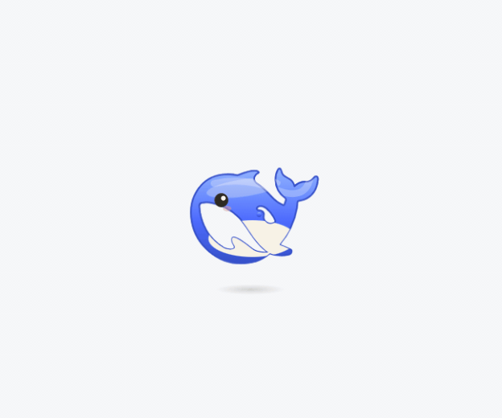

# pet-whale 🐳

English | [中文](README.md)

A desktop pet plugin for DeepSeek Harness (DSH), works in both the desktop app and the web UI. A small whale floats in the bottom-right corner and reacts to your agent's state in real time.

It uses the official DeepSeek whale outline, pure DOM animations, zero runtime third-party dependencies, and WebAudio-synthesized sound effects (no audio files).

<p align="center">
  
</p>

<p align="center"><sub>Poked until sulking → shaken dizzy → belly up → squashed → thinking → typing → multi-session badge → all done</sub></p>

<p align="center">
  <a href="#live-preview">Live preview</a> ·
  <a href="#install">Install</a> ·
  <a href="#features">Features</a> ·
  <a href="#community-forks">Community forks</a> ·
  <a href="#development">Development</a>
</p>

## Live Preview

Open the standalone preview page to try every state and interaction:

👉 **<https://nzl153.github.io/dsh-pet-whale/preview.html>**

[preview.html](preview.html) loads the real plugin (`lib/client.js`) and feeds it state from a few buttons instead of DSH; serve the repo root with any static server to run it locally.

## Install

In the profile directory you are using (the desktop app and the web UI each have their own; for the web UI it is usually `~/.dsh/profiles/web`), add the dependency and the bundle to `package.json`:

```json
{
  "dependencies": { "pet-whale": "^1.2.4" },
  "dsh": { "profile": { "bundles": ["...existing...", "pet-whale"] } }
}
```

Then run `pnpm install` in that directory and restart DSH. For the desktop app, quit from the tray and reopen it.

Without npm:

```sh
# Local directory install (the repo already contains built lib/, no build needed)
dsh plugin --profile web add link:/path/to/pet-whale

# Or install directly from Git
dsh plugin --profile web add "github:nzl153/dsh-pet-whale#main"
```

Requires DSH `>=0.1.5-alpha.2 <0.2.0` and Node.js `^22.19.0 || >=24.0.0`. See [Compatibility](#compatibility) for how each release was checked.

## Features

### State & companionship

| Capability | Description |
|---|---|
| State machine | idle / think (diving) / working (swimming + typing + code particles) / celebrate (leaping + bubbles) / error (shaking + black lines) / disappointed (a brief slump after an error) / wait (waiting for your input); priority: error > celebrate > think > working > idle |
| Expressions | The eyes follow the mood: squinted ^ when celebrating, drooping with a worried brow and a falling tear when disappointed, crosses on error, crescents when sleeping or belly up, an angry brow when sulking, >_< when grabbed |
| Turn semantics | Never idle while a turn is running: with tools = working, without tools (text or internal reasoning) = think diving; keyboard animation sticks for 2.5s during tool-heavy phases |
| Think ticker | While thinking, the latest reasoning text scrolls above the whale (can be toggled) |
| Follow all sessions | DSH 0.1.7+: when the current session is idle but another one is running, the whale keeps working and a little bubble badge in front of its head shows how many are running (it rides the body's bobbing, sways gently, and pops when the number changes); when another session finishes it celebrates and names it, and it tells you which session is waiting for confirmation. Subagents don't count. Can be turned off under "More settings → Behavior" |
| Parallel chatter | With follow-all on: at 2 sessions running at once (current included) it cheers about the parallel push, at 4 it starts complaining about overtime; each level is announced once, and only when a batch that really ran in parallel is fully done does it sigh "so tired... finally got every last one done" |
| Error care | Click the whale during error state to copy the error text |
| Comforting | Poking during the post-error disappointed state counts as comfort: a happy animation, a warm line, and the sulk ends early |
| Bond level | Interactions, completed turns and days together all feed one score, split into three tiers: Acquainted / Close / Inseparable. The tier changes poke lines and greetings, and at Inseparable the whale occasionally speaks up on its own; it announces each promotion, and the current tier and progress show up under Companion Stats |
| Idle micro-movements | Random swimming, looking around, and bubble blowing |
| Free swimming | Toggle "Swim" to let the whale roam the page along cubic Bezier paths, with banking, adaptive flipping, depth dives, wake ripples, and splashes; it yields while the agent is busy, and the preference is persisted |

### Interactions

| Capability | Description |
|---|---|
| Basics | Click to poke, double-click 360° flip, drag with >_< eyes, right-click quick menu, mouse-follow eyes, 20s idle sleep |
| Headpat | No buttons needed: rub the cursor back and forth over its head and the cursor turns into a little hand. From the second stroke it squints and blushes, each stroke presses its head down a little, and every five strokes a heart floats up. Keep rubbing frantically (eight strokes in about a second) and it frowns, grumbles about going bald, swims off, and refuses pats for five seconds. Patting it while disappointed counts as comfort. The right-click "Headpat" and a 0.7s long press play the same reaction |
| Poke escalation | Pokes 1-2 get the usual squish, 3-5 make it lean away annoyed, 6+ turn it away with an angry brow; the streak decays after 2.6s of no poking, and it drops the mood the moment the agent starts working |
| Shake dizzy | Grab it and swing it left and right - four direction changes within a second make it dizzy: the eyes go @@, it begs you to stop, and the body keeps wobbling after you let go; hand tremor and slow back-and-forth do not count. It stays woozy for the next dozen seconds too, with a visibly crooked swim path |
| Belly up | The double-click reaction follows your bond: normally a 360 spin, but at Inseparable it rolls over and shows you its belly |
| Edge squash | Push it against a screen edge and it flattens: narrower against the left and right edges, a whale pancake against the top and bottom, squashing from the edge it is pressed on; in a corner only left/right counts. It springs back once you move away |
| Held too long | Hold it in midair for over 2 seconds and it starts squirming to ask if you are still there; moving stops the nagging |
| Smart avoidance | In idle, the whale moves aside when the cursor lingers nearby; grabbing/right-click cancels and cools down for 8s |

<details>
<summary><b>Reminders</b>: finish alert, break reminder, scheduled hide</summary>

| Capability | Description |
|---|---|
| Finish alert | When a turn completes while you are on another tab, the tab title becomes "✅ Done · <original>" and restores when you come back; an optional system notification is off by default and only asks for permission when you enable it |
| Break reminder | Set 45 / 60 / 90 minutes and the whale surfaces with a spout to nudge you; off by default, and leaving the page for over 10 minutes counts as a rest and resets the timer |
| Scheduled hide | Hide after 1 hour or every day at 22:00 |

</details>

<details>
<summary><b>Appearance & settings</b>: skins, size, sound, hide/recall, languages and more</summary>

| Capability | Description |
|---|---|
| Skins | 7 built-in palettes (default Theme Blue), extensible by adding one line in `src/client/palettes.ts` |
| Custom size | Right-click - Appearance - Size cycles through Small / Standard / Large / Huge (0.8x - 1.6x). Scaling also moves the collision bounds, splash origins and edge detection, not just the visual |
| Sound | WebAudio-synthesized sounds, can be muted; "More settings → Behavior → Volume" cycles Muted / Low / Medium / High, remembered across reloads |
| Pretend work | "Pretend to work" mode keeps the typing animation on; preference is persisted |
| Hide/recall | Hide to a small 🐳 button; state persists across refresh |
| Quick menu & settings | Right-click opens a compact quick menu; "More settings" opens a grouped panel (appearance / behavior / stats) |
| Stats | The settings panel keeps running counts of completions, interactions, errors, and days spent together |
| Localization | Full Chinese and English copy, following the DSH locale service automatically; the standalone preview page detects the browser language and can be overridden manually |
| Theme sync | Follows DSH light/dark theme for bubbles, dialogs, and shadows |
| Background power saving | Animations, sounds, and the think ticker pause when the page is hidden |
| Accessibility | Respects `prefers-reduced-motion` |

</details>

## Community forks

The whale itself is maintenance-first (see [CONTRIBUTING.md](CONTRIBUTING.md)). If you want more,
take a look at these forks:

- [wzwei1990/dsh-pet-whale](https://github.com/wzwei1990/dsh-pet-whale) — multi-pet architecture
  (switch between the whale, a cat and Ling'er, each with its own SVG, animations and lines),
  plus a `pnpm pet:doctor` health-check script

These forks are maintained independently and are not affiliated with this repository. Please read
their own documentation before using them.

## Development

### Build & Test

```sh
pnpm install
pnpm typecheck   # TypeScript type check
pnpm dev         # dev watch: rebuild lib/client.js on src/client changes; DSH HMR applies it automatically
pnpm build       # tsdown → lib/index.mjs + lib/client.js
pnpm test        # jsdom smoke test (state machine / interactions / skins / cleanup)
pnpm verify:hmr  # verify local repo <-> running DSH HMR wiring
```

- `src/client/palettes.ts` — palette extension point. Add one line for a new skin.
- `scripts/verify-live.mjs` — one-click live verification after restart.
- State source (dsh 0.1.5): session lifecycle comes from the `ctx.sessions` snapshot
  (`running` / `lastAgentError` / `openError`); `partial` / `runningCalls` / `turnEnds` come from the
  chat projection on `ctx.uiConversation` (`ChatSnapshot.legacy`). The field-by-field mapping lives at the
  top of `src/client/state.ts`.
- 0.1.7 changes: the current session is the list row with `retainedBy.mainView > 0` (the list no longer has
  `current`); per-session running / pending confirmation comes from `ctx.uiSession.sessionStatus` and drives the
  wait state and follow-all-sessions. 0.1.5 has no `sessionStatus`, so both are simply inactive there.
- [patches/](patches/) holds early personal UI patches written for DSH rc.6. They are not part of this plugin, no longer maintained, and kept for reference only.

### Hot Reload

Prerequisite: the DSH profile installs this repo via `link:` (not a static GitHub/npm copy), and DSH `>=0.1.5-alpha.2`.

`pnpm dev` watches `src/` and rebuilds `lib/client.js` (and the host half `lib/index.mjs`).
The built-in `@deepseek-ai/dsh-client-hmr` polls for rebuilds and broadcasts through `/plugins/events`;
the browser invalidates and reloads this plugin automatically. **Client-only changes do not require a DSH restart or a page refresh.**

- Hot-reloadable: `src/client/**` UI, styles, state machine, interactions.
- Still requires a DSH restart:
  - changes to `package.json` `dsh.client` / `dsh.bundle` / `exports` structure
  - `cordis.patch.yml` or host half `src/index.mjs` composition changes
  - installing/uninstalling dependencies, upgrading DSH, changing the profile bundle list
- Verify wiring with DSH running: `pnpm verify:hmr`.

### Compatibility

<details>
<summary>Supports DSH 0.1.5 – 0.1.7; 0.1.7-rc.2 and 0.1.5-rc.2 were run on a real host. Expand for the basis of each release</summary>

| DSH release | Status | Basis |
|---|---|---|
| `0.1.7-rc.2` | compatible | Ran on a real host: tool call `idle → think → working`; switching to another session mid-turn shows badge 1 without a false celebrate; when the background session finishes it celebrates, names the session, and falls back after 2.5s; zero console errors. Also in daily use on the official desktop app preview |
| `0.1.7-rc.1` | compatible | Not run. npm type comparison: the only differences from rc.2 are in the model-catalog interfaces; the session list, session snapshot, chat projection and `sessionStatus` this plugin reads are unchanged |
| `0.1.5-rc.3` | compatible | Not run. Only pins dependency versions relative to rc.2 |
| `0.1.5-rc.2` | compatible | Ran on a real host: new session, tool call, plain-text turn — zero console errors, `idle → think → working → celebrate → idle` all fired, and celebrate self-expires back to idle after 2.5s (no next message needed to unstick it) |
| `0.1.5-rc.1` | compatible | Not run. Per-file npm comparison: `dsh-api-session-controller`, `dsh-client-ui-conversation`, `dsh-client-locale`, `dsh-client-modules`, `dsh-cordis-client-runner` are **byte-identical** to rc.2; `dsh-client-ui-chat` differs only by a 15-character CSS tweak unrelated to the `legacy` projection this plugin reads |
| `0.1.5-alpha.2` | compatible | Not run. Same as above; the only difference is a doc-string line number (`contract.ts:23` → `:24`) in `dsh-cordis-client-runner` |

The previous 1.1.0 threw `TypeError: Cannot read properties of undefined (reading 'length')` on every session-snapshot
update under 0.1.5. The field-by-field mapping and the fix are documented at the top of `src/client/state.ts`.
1.1.2 doesn't throw under 0.1.7 but stays idle forever: 0.1.7 removed `current` from the session list, so the plugin
couldn't find the current session. Since 1.1.3 it uses the session held by the main view.

</details>

## License

[MIT](LICENSE)
